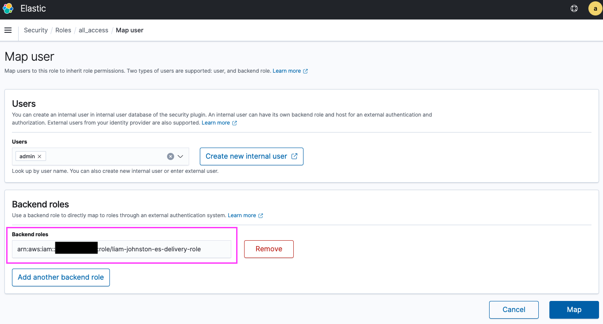

# Kinesis Workshop

Getting your hands dirty with Amazon Kinesis.

The cost of running this workshop can creep up so be sure to clean up everything when you're done. How to clean this up is outlined below.

## What exactly does this project do?

This project is a good example of what can be accomplished with Kinesis data analytics and how to develop a scalable data solution using Kinesis Firehose.


This project creates an ec2 instance which has a [user_data](./deploy/modules/server/src/user-data.sh) script that performs a number of actions.

After updating and installing the required packages the ec2 instance will pull down and run a python script to generate mock apache web access logs. It uses [this project](https://github.com/kiritbasu/Fake-Apache-Log-Generator) to generate these fake logs. Several instances of this script are run simultaneously to increase the volume of logs being generated.

A Kinesis agent is then started on the ec2 instance and configured to tail these log files and send them to the log ingestor firehose.

Once the logs have been ingested by the first firehose they are written to an S3 bucket.

A data analytics application also reads the same firehose stream and performs a simple aggregation to count the number of different status codes in the logs. This definition of this aggregation is defined in [this SQL code](./deploy/modules/analytics-app/src/app.sql).

The output of this aggregation is then streamed to another firehose which then feeds into an Elasticsearch cluster. Any records that fail to deliver get recorded and put into an error log bucket.

Once these logs have been successfully delivered to the Elasticsearch cluster you can visualise the records.

N.B.: There is some manual setup required for the Elasticsearch cluster which is outlined [in this section](#Elastic-Search-Role-Setup).

## Usage

1. Update values for `TF_STATE_BUCKET`, `TF_STATE_KEY`, `TF_STATE_REGION`, `OWNER` and optionally specify a value for `DEPLOY_REGION` in [`the Makefile`](./Makefile).

2. Execute Terraform using Makefile commands:
```
make run_plan
make run_apply
```

3. Go and make yourself a coffee, it takes around 10-15 minutes for the Elasticsearch cluster to be created.

4. Once you've finished and want to clean up the deployed infrastructure you can execute the following commands to ensure everything is destroyed.
```
make run_destroy_plan
make run_destroy_apply
```

## Elasticsearch Role Setup

Once the Elasticsearch domain has been created you need to log on to the Kibana endpoint and set up the backend role for Kinesis firehose to be able to put records into the search cluster.

The Kibana endpoint is outputted to the console when you deploy this project. The login details are stored in secrets manager under `<YOUR_NAME>/kinesis-workshop/es_credentials`.

Once you log into the Kibana dashboard you'll need to add the role that the log delivery kinesis firehose assumes as a backend role for the search cluster. You do this by:

1. Navigate to the URL outputed from the deployment to add the backend role required by Kinesis to create an index and insert the logs.

2. Click on the `Mapped users` tab


3. Click on the Manage mappings button


4. Insert the outputted firehose role arn into the backend roles section



5. Click Map


The Firehose roles should now have permission to insert the analysed log results into the Elasticsearch cluster.

## Visualising the results

Each of the records that are sent to the Elasticsearch cluster has been calculated in our analytics application to be a count of the number of various statuses that have occurred over a small window of time. For our visualisation, we want to display a total count of these different statuses throughout the webservers lifetime. This could be achieved by performing an aggregation across all the logs in elastic search but executing it in this way significantly reduces the load on the Elasticsearch cluster as the number of indexed records is reduced to a much smaller constant amount per time window. In this project, we create about 20 records per second from our log server. This then gets aggregated down to .06 records per second sent to our Elasticsearch cluster. No matter how much the number of logs created grows that 0.06 records per second ingestion rate of the elastic search cluster will stay constant.

After the backend role has been successfully configured in Elasticsearch you can begin to build a visualisation of the data. The steps to achieve this are as follows:

1. Click on the visualise option in the side menu, this is the area where you can build visualisations of the data ingested into the Elasticsearch cluster.


2. Click on create index. if this screen looks different it might be because records haven't had time to be ingested yet, give it a minute or two and hopefully, the screen will look like the one below. If after a couple of minutes the screen is still not the same as the one below you might be having errors with role permissions, ensure you have followed [the section](#Elastic-Search-Role-Setup) on setting up backend roles. To help troubleshoot you can check the error bucket that the es-delivery firehose is configured with for error records.


3. The index that the firehose puts the logs into is called `analysed-logs` so you will need to create this index pattern in Elasticsearch, the source that shows up will have the date appended to it so creating an index pattern of `analysed-logs*` will capture all these records no matter what date they are ingested.


4. Navigate back to the visualiser page.


5. Click create new visualisation.


6. Choose a line visualisation as this is appropriate for the type of data we are trying to display.


7. Choose the newly created index pattern.


8. Configure the visualisation as follows.


9. View the visualisation.


